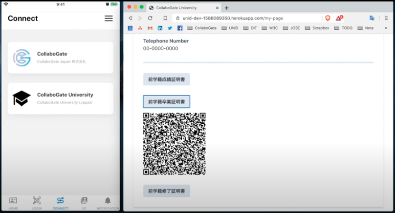

# Introduction

## Digital Identity

Digital Identity is the front door of every user interactions in digital society. As digital transformation accelerates in all industries, it is necessary to build solutions on common standards for security and privacy in order to communicate smoothly online.

The traditional identity systems today are fragmented, insecure, and do not have sufficient functionality to verify whether the data transferred is reliable in human social activity. For example, when using digital services, we are always required to create accounts and store a small part of our digital identity in the databases of these service providers. Consequently, digital identities become fragmented and locked into numerous different databases controlled by multiple external third parties.

The model of centralized identity systems increases the security and privacy risks for the business and makes it difficult to share data across services. As long as business holds a vast amount of personal information, security risks such as unauthorized access, internal leaks, and data tampering will occur. In addition, sharing data across services requires not only the time and effort of data collection, verification, and collation, but also the significant cost of data processing and handling to ensure privacy protection which have become increasingly responsible in recent year.

Although these issues have been recognized as common business challenges and risks across the world and various industries, they were difficult to solve fundamentally. At the core of these issues is the fact that the current structure of the Internet is not equipped with digital identity and data verification mechanisms to build digital trust.

At UNiD, we are focused on building decentralized identity platform as the future of the Web where distributed users and machines are able to interact with verifiable data without the need for third parties. To achieve this goal, it's important first step to establish a globally unique identity that can be controlled directly by a user without the need for centralized authorities or trusted third parties.

## Decentralized Identity

Decentralized identity, also know as self-sovereign identity \(SSI\), is a digital movement that evolves digital identity on the Internet based on open web standards at organizations such as the [W3C](https://www.w3.org/), [Decentralized Identity Foundation](https://identity.foundation/), [IETF](https://ietf.org/), and [the Hyper ledger Project at the Linux Foundation](https://www.hyperledger.org/). A central part of the movement is the emerging standardization around Decentralized Identifiers \(DIDs\) which is a new type of identifier to allow individuals to create and control their own unique identifiers.

In contrast to typical, federated identifiers, DIDs have been designed so that they may be decoupled from centralized registries, identity providers, and certificate authorities. Any subject \(e.g., a person, organization, thing, data model, abstract entity, etc.\) can use these identifiers to obtain verifiable credential \(VC\) from trusted organizations and present these credentials as proof of claims about themselves.

The roles of the core actors and the relationships between them in an ecosystem where DIDs and verifiable credentials are expected to be useful.

In order to take full advantage of the capabilities of DIDs and verifiable credentials, it is necessary to minimize the cost of communication between the applications composed of the DIDs and existing services. UNiD provides the fundamental capabilities of DIDs and verifiable credentials, and SDKs for easy integration with existing services.



## Use Cases

### Intro to a digital student wallet

In order to understand the roles in DID ecosystem and how to establish **digital trust**, we introduce a demonstration of a digital student wallet built on the top of UNiD platform. This demonstration shows password less login and credential issuance when students apply for transcripts to their university.

A student can easily login to the website without any password in a secure manner. A service provider \(in this case, it may be a vendor or university\) can provide a seamlessly onboarding process to students without retaining personal data in their database.

A student goes to transcript apply page and read a QR code for a request. The web application issues a transcript with the university's signature and send the credential of transcript to a student. Students can bring and present the credential to other parties as proof of his educational history.

This sort of credentials can be presented to enterprises for applying a job. The enterprise as a verifier can cryptographically verify the credential without contacting the issuer. That begins establishing **digital trust** around that DIDs by using it in their digital interactions. Through UNiD SDKs, our platform offers convenient and easy-to-access application logic to build such solutions and integrate with digital services that exist out of our platform.

### Wide variety of use cases

Our platform is composed of a collection of micro services, allowing developers to combine pluggable and extensible modular for flexibility and freedom of choice without compromising security for a wide variety of applications for:

* Online Bank
* Insurance
* Human Resource
* Education
* Tele Communication
* Healthcare
* Gig Economy
* B2B transaction
* SmartCity
* IoT
* Energy
* Travel
* Government


🧠 **NOTE**: We are currently working on joint projects with leading companies in each industry → [Click here for more info](https://collabogate.com)


