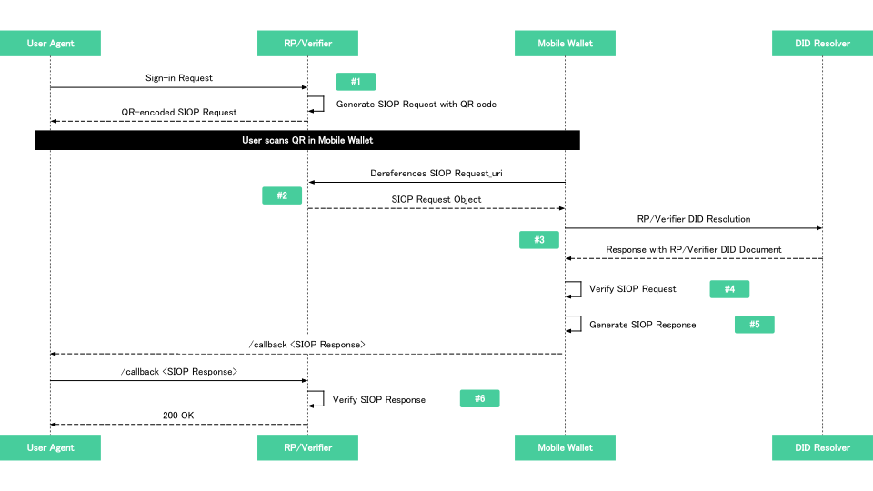

# DID AuthN

## Introduction

For the web server to communicate with identity wallet on secure authenticated channel, UNiD Nodejs SDK provide methods of:

* generating DID AuthN Request
* validating DID AuthN request from an identity wallet

The below diagram illustrate the sign-in flow and steps taken to verify a user through their user agent from the wallet side of the webpage to the server side of a RP. If you want to see more details of DID AuthN, please head over [here](../unid-platform/#unid-core).



## Generate SIOP Request

In step \#1 of the diagram, the web server creates a SIOP request signed by the application's DID. The web server can specify the credential type as the information required for authentication.

**DID.generateAuthenticationRequest\(\)**



```typescript
import { UNiD } from '@unid/node-wallet-sdk'

(async () => {
    try {
        const result = await DID.generateAuthenticationRequest({
            requiredCredentialTypes: [
                'AddressCredentialV1',
                'NameCredentialV1',
                'EmailCredentialV1'
            ],
            optionalCredentialTypes: [
                'GenderCredentialV1'
            ]
        })
        
        console.log('Complete generating DID AuthN Request', result)
    } catch err(err){
        console.err(err)
    };
})()
```



## Validate AuthN Response

In step \#6 of the diagram, the web server receives an SIOP response from the mobile wallet. The web server queries for the wallet's DID document using DID Resolver and verifies the signature with the wallet's public key.

**UNiD.validateAuthenticationResponse\(\)**



```typescript
import { UNiD } from '@unid/node-wallet-sdk'

(async () => {
    try {
        // Verify SIOP Response with walletDid
        const result = await UNiD.validateAuthenticationRequest(walletDid)
        console.log('Complete validating DID AuthN Request', result)
    } catch err(err){
        console.err(err)
    }
})()
```



If the required parameter or authorization code is not included in the response, an error will occur and the authentication process will be interrupted.

